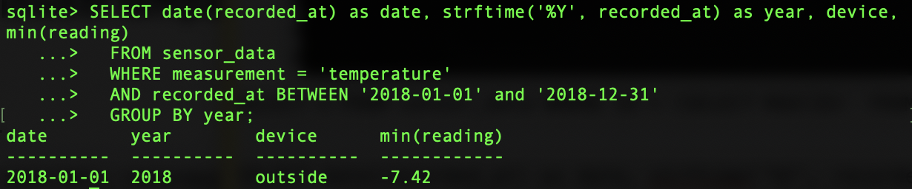
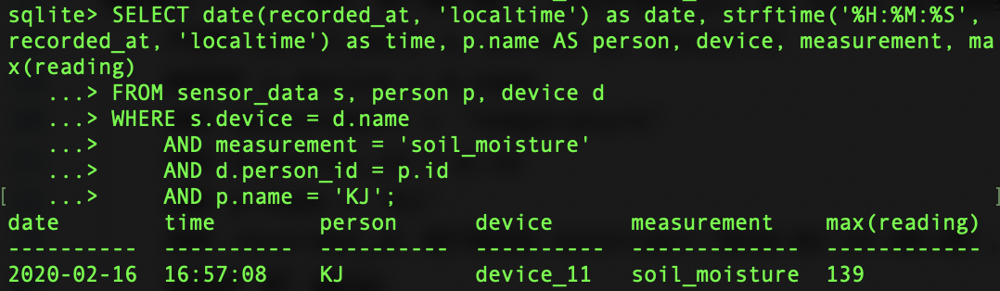
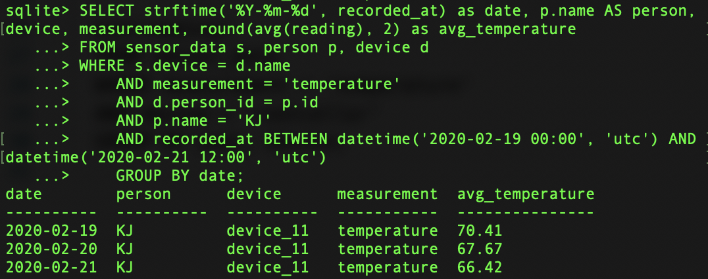

<h1>Assignment 4</h1>

<h2>2. Use the farm database. Write queries to answer the following questions:</h2>

<h3>a. When did the outside sensor break and stop sending data?</h3>

	SELECT strftime('%Y-%m-%d', recorded_at) as day, device, max(recorded_at)
      FROM sensor_data
      WHERE measurement = 'temperature' 
      AND device = 'outside';

<b>Answer:</b> 2020-01-20

<h3>b. Show the min and max temperature in the root cellar by year</h3>

Getting a min temperature in the root cellar by year

	SELECT date(recorded_at) as date, strftime('%Y', recorded_at) as year, device,
      min(reading)
      FROM sensor_data 
      WHERE measurement = 'temperature' 
      AND device = 'rootcellar'
      GROUP BY year, device;

Getting a max temperature in the root cellar by year

	SELECT date(recorded_at) as date, strftime('%Y', recorded_at) as year, device,
      max(reading)
      FROM sensor_data 
      WHERE measurement = 'temperature' 
      AND device = 'rootcellar'
      GROUP BY year, device;

<h3>c. What was the lowest temperature recorded 2018?</h3>

	SELECT date(recorded_at) as date, strftime('%Y', recorded_at) as year, min(reading)	
      FROM sensor_data 
      WHERE measurement = 'temperature'
      AND recorded_at BETWEEN '2018-01-01' and '2018-12-31'
      GROUP BY year;

<b>Answer:</b> -7.42

<h3>Challenge: Which sensor recorded the lowest temperature 2018 and when? Hint: you need a subquery.</h3>

	SELECT date(recorded_at) as date, strftime('%Y', recorded_at) as year, device, min(reading)	
      FROM sensor_data 
      WHERE measurement = 'temperature'
      AND recorded_at BETWEEN '2018-01-01' and '2018-12-31'
      GROUP BY year;

<b>Answer:</b> Outside

<h2>3. Write two queries that use data from your sensor.</h2>

<h4>3.1 Getting the date when soil moisture data was the highest</h4>

	SELECT date(recorded_at, 'localtime') as date, strftime('%H:%M:%S', recorded_at, 'localtime') as time, p.name AS person, device, measurement, max(reading)
      FROM sensor_data s, person p, device d
      WHERE s.device = d.name
      AND measurement = 'soil_moisture'
      AND d.person_id = p.id
      AND p.name = 'KJ';

<b>Answer:</b> 2020-02-16

<h4>3.2 Getting the average temperature by day for the time period from February 19 to February 21</h4>

	SELECT strftime('%Y-%m-%d', recorded_at) as date, p.name AS person, device, measurement, round(avg(reading), 2) as avg_temperature
      FROM sensor_data s, person p, device d
      WHERE s.device = d.name
      AND measurement = 'temperature'
      AND d.person_id = p.id
      AND p.name = 'KJ'
      AND recorded_at BETWEEN datetime('2020-02-19 00:00', 'utc') AND datetime('2020-02-21 12:00', 'utc')
      GROUP BY date;

