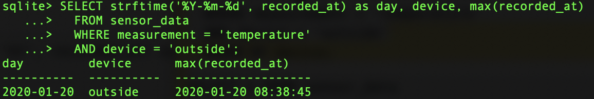
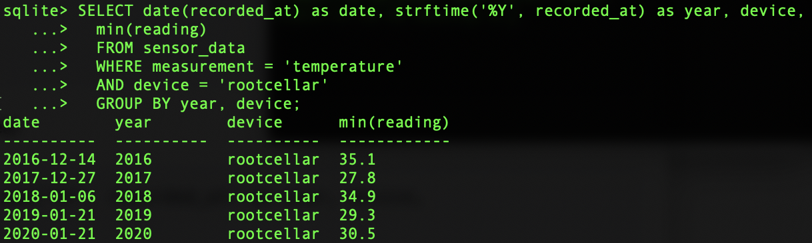
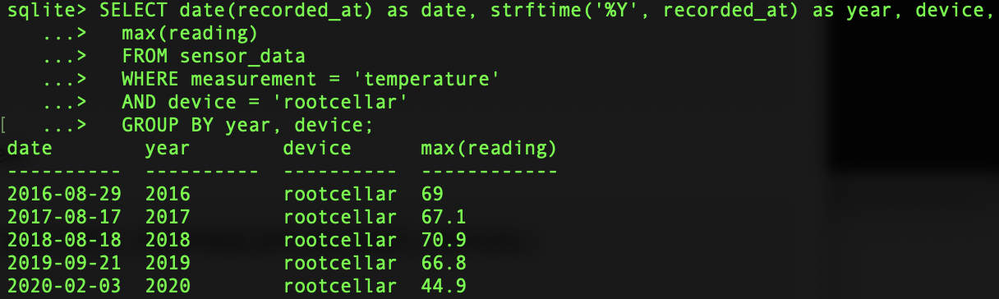
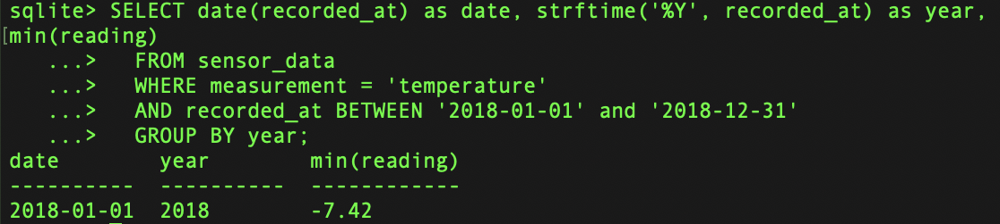
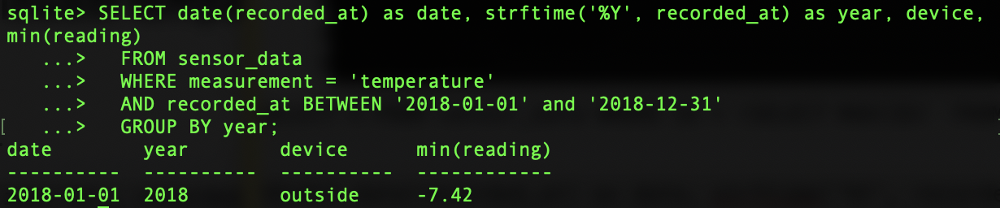

<h1>Assignment 4</h1>

<h2>2. Use the farm database. Write queries to answer the following questions:</h2>

<h3>a. When did the outside sensor break and stop sending data?</h3>

	SELECT strftime('%Y-%m-%d', recorded_at) as day, device, max(recorded_at)
      FROM sensor_data
      WHERE measurement = 'temperature' 
      AND device = 'outside';

<h3>b. Show the min and max temperature in the root cellar by year</h3>

Getting a min temperature in the root cellar by year

	SELECT date(recorded_at) as date, strftime('%Y', recorded_at) as year, device,
      min(reading)
      FROM sensor_data 
      WHERE measurement = 'temperature' 
      AND device = 'rootcellar'
      GROUP BY year, device;

Getting a max temperature in the root cellar by year

	SELECT date(recorded_at) as date, strftime('%Y', recorded_at) as year, device,
      max(reading)
      FROM sensor_data 
      WHERE measurement = 'temperature' 
      AND device = 'rootcellar'
      GROUP BY year, device;

<h3>What was the lowest temperature recorded 2018?</h3>

	SELECT date(recorded_at) as date, strftime('%Y', recorded_at) as year, min(reading)	
      FROM sensor_data 
      WHERE measurement = 'temperature'
      AND recorded_at BETWEEN '2018-01-01' and '2018-12-31'
      GROUP BY year;

<h2>3. Which sensor recorded the lowest temperature 2018 and when? Hint: you need a subquery.</h2>
Write two queries that use data from your sensor.

	SELECT date(recorded_at) as date, strftime('%Y', recorded_at) as year, device, min(reading)	
      FROM sensor_data 
      WHERE measurement = 'temperature'
      AND recorded_at BETWEEN '2018-01-01' and '2018-12-31'
      GROUP BY year;

