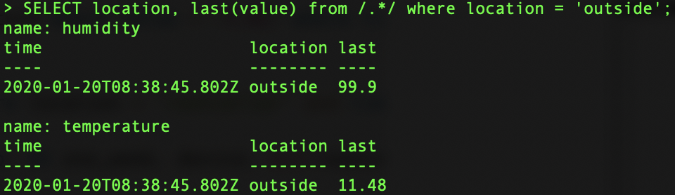
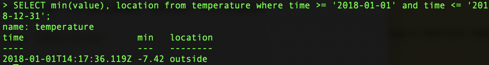
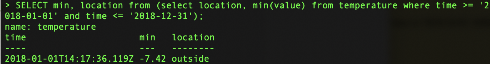
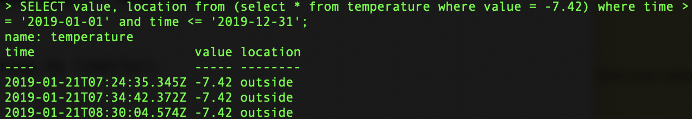
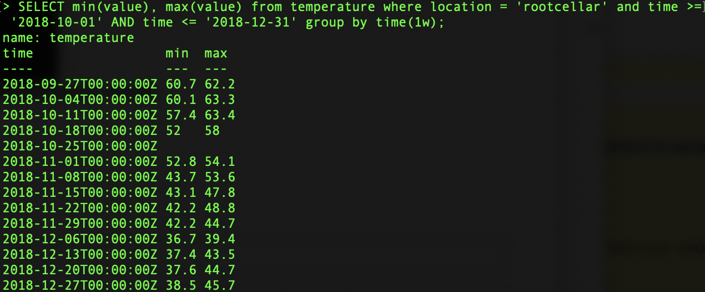
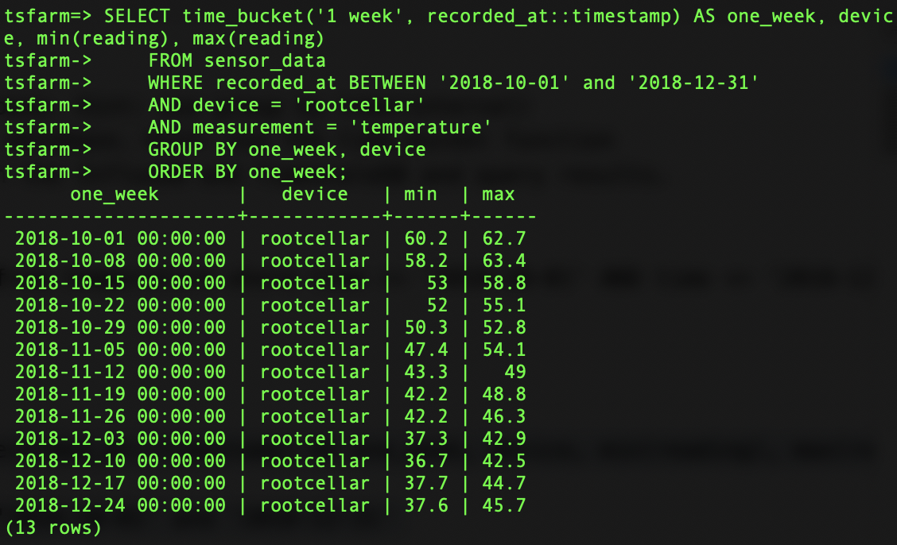

<h1>Assignment 5</h1>

<h3>2. Use the farm database on InfluxDB. Write queries to answer the following questions:</h3>

<h4>a. When did the outside sensor break and stop sending data?</h4>

    SELECT location, last(value) from /.*/ where location = 'outside';

<h4>b. What was the lowest temperature recorded in 2018? Which sensor recorded this data?</h4>
First, find what is the minimum value.  
    
    SELECT min(value), location from temperature where time >= '2018-01-01' and time <= '2018-12-31';

Then add subquery. 

    SELECT min, location from (select location, min(value) from temperature where time >= '2018-01-01' and time <= '2018-12-31');
    

Test with 2019 data if the subquery was right. 

    SELECT value, location from (select * from temperature where value = -7.42) where time >= '2019-01-01' and time <= '2019-12-31';

<h3>3. Find the min and max temperatures by week for the root cellar for the last 3 months of 2018.</h3>
<h4>a. Use InfluxDB and the farm database. Hint: use group by time(interval)</h4>

    SELECT min(value), max(value), location from temperature where location = 'rootcellar' and time >= '2018-10-01' AND time <= '2018-12-31' group by time(1w);

<h4>b. Use TimescaleDB and the tsfarm database. Hint: use the time_bucket function</h4>

	SELECT time_bucket('1 week', recorded_at::timestamp) AS one_week, device, min(reading), max(reading)
      FROM sensor_data
      WHERE recorded_at BETWEEN '2018-10-01' and '2018-12-31'
      AND device = 'rootcellar'
      AND measurement = 'temperature'
      GROUP BY one_week, device
      ORDER BY one_week;

<h4>c. Explain the differences between the InfluxDB and TimescaleDB and query results.</h4> 
I don’t quite understand why they gave me different results but one thing I realized is that the time frames offered by those two databases are different. Even if I set the same time period, between '2018-10-01' and '2018-12-31',  the InfluxDB, for example, starts counting from 9/27/2018 unlike the TimescaleDB, which starts counting from 10/1/2017.
