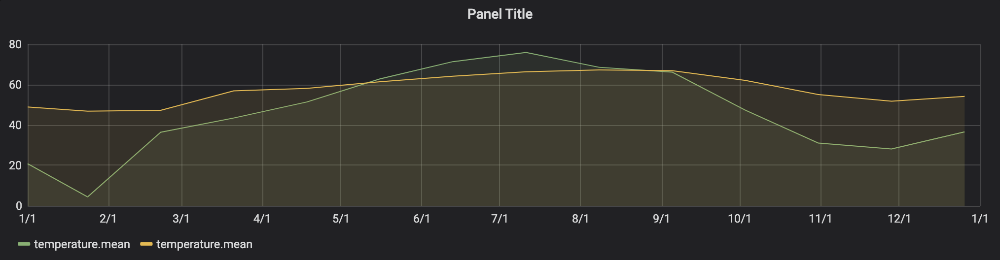
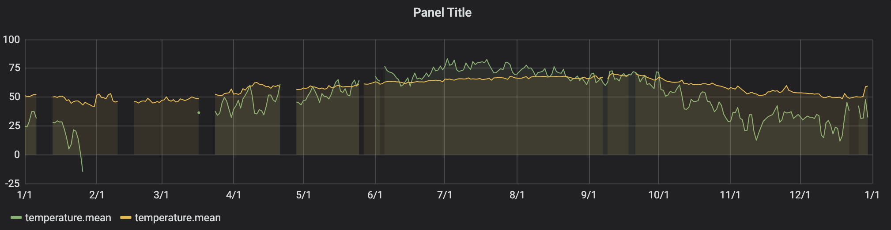
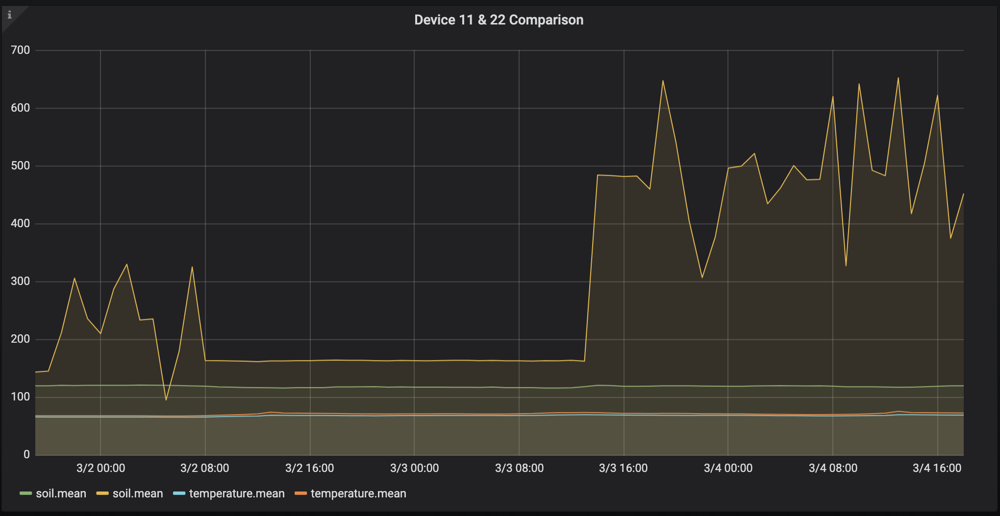
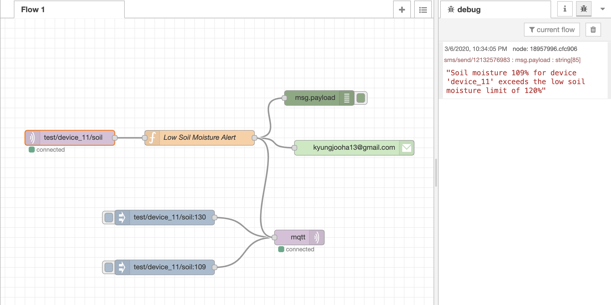
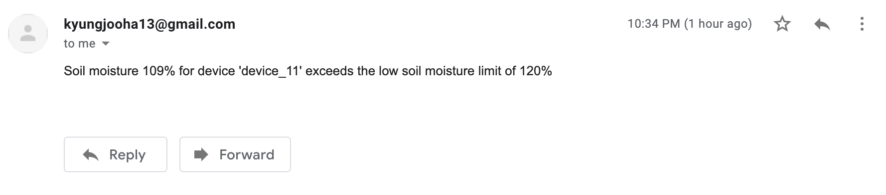
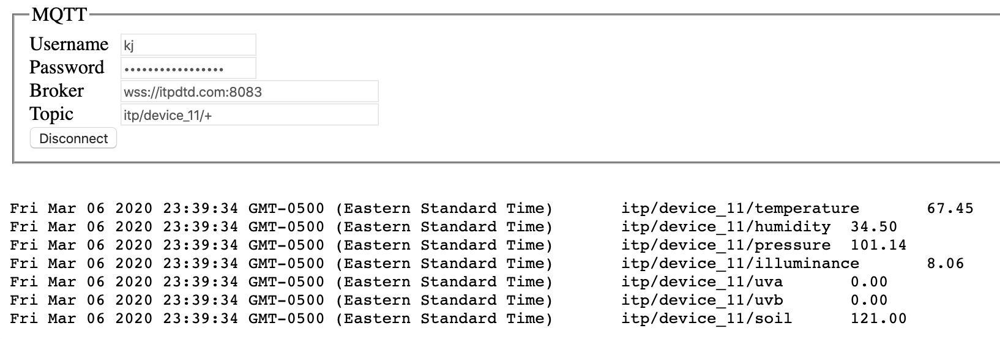
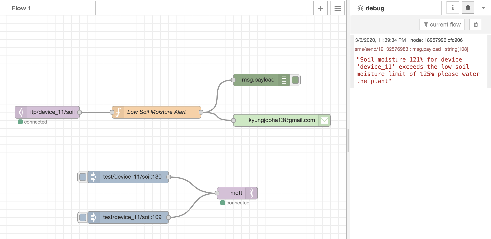
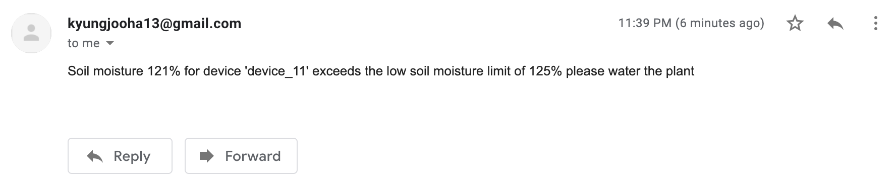

<h1>Assignment 6</h1>
<h2>Grafana</h2>

Links to Grafana dashboard. 

Farm database: https://grafana.itpdtd.com/d/IXswOulZz/assignment-06_kj?from=1583107200000&to=1583362800000  
ITP database: https://grafana.itpdtd.com/d/IXswOulZz/assignment-06_kj?from=1546318800000&to=1577854800000

The above two links will take you to the same dashboard but I just couldn't figure out how to enable multiple time ranges for different panels in one dashboard.

<h3><b>Farm Database</b></h3>

I decided to compare the differences in temperature changes outside and in the basement. Usually, the basement is the place less likely to get affected by outside changes so, I would like to visualize those differences.
 affected by outside changes so, I would like to visualize those differences.

First I grouped data by 4 weeks (roughly a month) to see the general changes over the year.

    # outside temperature
    SELECT mean(value) from temperature where location = 'outside' and time >= '2019-01-01' AND time <= '2019-12-31' group by time(4w) tz('America/New_York');

    # basement temperature
    SELECT mean(value) from temperature where location = 'basement' and time >= '2019-01-01' AND time <= '2019-12-31' group by time(4w) tz('America/New_York');

When I grouped data by 1 day, I realized that there are some missing values in the graph.

    # outside temperature
    SELECT mean(value) from temperature where location = 'outside' and time >=  '2019-01-01' AND time <= '2019-12-31' group by time(1d) tz('America/New_York');
    
    # basement temperature
    SELECT mean(value) from temperature where location = 'basement' and time >= '2019-01-01' AND time <= '2019-12-31' group by time(1d) tz('America/New_York');

<h3><b>ITP Database</b></h3>

Since Stacy (device 22) and I picked the same plant, I thought it might be interesting to compare the sensor values being sent by the two devices.

As the soil of the plant we picked is getting really dry, I first wanted to check the soil moisture data. 

As the graph above shows, while my soil sensor consistently sending fairly low values, the values being sent by Stacy's sensor are more dynamic and this made me concerned if my sensors are malfunctioning or not.

    # device 11
    SELECT mean(value) FROM soil WHERE device = 'device_11' AND time > '2020-03-05'- 3d AND time < '2020-03-05' GROUP BY time(1h);

    # device 22
    SELECT mean(value) FROM soil WHERE device = 'device_22' AND time > '2020-03-05'- 3d AND time < '2020-03-05' GROUP BY time(1h);

Comparing temperature

    # device 11
    SELECT mean(value) FROM temperature WHERE device = 'device_11' AND time > '2020-03-05'- 3d AND time < '2020-03-05' GROUP BY time(1h);

    # device 22
    SELECT mean(value) FROM temperature WHERE device = 'device_22' AND time > '2020-03-05'- 3d AND time < '2020-03-05' GROUP BY time(1h);

When I compared the temperature values there are no visible differences between the values sent by devices 11 and 22. I assumed other sensors are working okay.
 

<h2>Node-RED</h2>
Link to exported version of the flow: https://github.com/TTurbo0824/device-to-database/blob/master/flows.json

I designed the flow that sends out the text/email when the soil moisture values are lower than 125%.

<b>Test flow using injects. I first set the value for alert to 120%</b>
 

Flow

 

Email

MQTT data

 

Flow

 

Email

